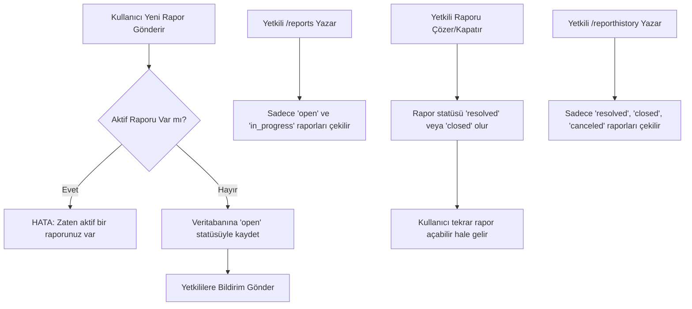

# Raporlama Yönetim Sistemi Mimarisi ve Veritabanı Şeması

Bu belge, FiveM (QBCore/ESX) ortamları için optimize edilmiş uçtan uca raporlama (report) yönetim sisteminin veritabanı şemasını, SQL sorgularını ve iş akışını tanımlar.

## 1. Veritabanı Şeması (Database Schema)

Veri bütünlüğünü sağlamak ve rapor statülerini yönetmek için `player_reports` adında bir tablo tasarımı öngörülmüştür.

```sql
CREATE TABLE IF NOT EXISTS `player_reports` (
    `id` INT(11) NOT NULL AUTO_INCREMENT,
    `identifier` VARCHAR(60) NOT NULL COMMENT 'Kullanıcının benzersiz kimliği (citizenid, license vb.)',
    `player_name` VARCHAR(50) NOT NULL COMMENT 'Raporu açan oyuncunun adı',
    `report_type` ENUM('bug', 'player', 'question', 'other') NOT NULL DEFAULT 'question',
    `description` TEXT NOT NULL,
    `status` ENUM('open', 'in_progress', 'resolved', 'closed', 'canceled') NOT NULL DEFAULT 'open',
    `admin_id` VARCHAR(60) DEFAULT NULL COMMENT 'Raporla ilgilenen yetkilinin kimliği',
    `created_at` TIMESTAMP NOT NULL DEFAULT CURRENT_TIMESTAMP,
    `updated_at` TIMESTAMP NOT NULL DEFAULT CURRENT_TIMESTAMP ON UPDATE CURRENT_TIMESTAMP,
    PRIMARY KEY (`id`),
    INDEX `idx_status` (`status`),
    INDEX `idx_identifier_status` (`identifier`, `status`)
) ENGINE=InnoDB DEFAULT CHARSET=utf8mb4;
```

**Kısıtlamalar ve Optimizasyonlar:**
*   `ENUM('open', 'in_progress', 'resolved', 'closed', 'canceled')`: Sadece izin verilen durumların girilmesini zorunlu kılar (Veri bütünlüğü).
*   `INDEX idx_status`: Yetkililerin aktif veya geçmiş raporları çekerken yapacağı filtrelemeleri hızlandırır.
*   `INDEX idx_identifier_status`: Bir oyuncunun halihazırda açık bir raporu olup olmadığını sorgulayan doğrulama adımını (`Validation`) son derece hızlandırır.

## 2. İş Akışı ve Gerekli SQL Sorguları

### A. Rapor Oluşturma Süreci (Validation & Insert)
**Kural:** Kullanıcının statüsü `open` veya `in_progress` olan bir raporu varsa yeni rapor açamaz.

**1. Doğrulama Sorgusu:**
```sql
SELECT COUNT(*) as active_reports 
FROM `player_reports` 
WHERE `identifier` = ? AND `status` IN ('open', 'in_progress');
```
*Eğer `active_reports` > 0 ise, sistem kullanıcıya "Zaten açık bir raporunuz bulunuyor, lütfen çözülmesini bekleyin." uyarısı verir.*

**2. Kayıt Ekleme Sorgusu (Eğer Doğrulama Başarılıysa):**
```sql
INSERT INTO `player_reports` (`identifier`, `player_name`, `report_type`, `description`, `status`) 
VALUES (?, ?, ?, ?, 'open');
```

### B. Aktif Raporları Listeleme (`/reports` Komutu)
**Kural:** Yalnızca `open` ve `in_progress` olan aktif raporları getir.

```sql
SELECT `id`, `identifier`, `player_name`, `report_type`, `description`, `status`, `created_at`
FROM `player_reports` 
WHERE `status` IN ('open', 'in_progress')
ORDER BY `created_at` ASC;
```
*Not: Eskiden yeniye sıralanır (`ASC`), böylece en çok bekleyen rapor en üstte görünür.*

### C. Rapor Geçmişini Listeleme (`/reporthistory` Komutu)
**Kural:** Yalnızca çözülmüş, iptal edilmiş veya kapatılmış raporları getir (`resolved`, `closed`, `canceled`).

```sql
SELECT `id`, `identifier`, `player_name`, `report_type`, `description`, `status`, `admin_id`, `updated_at`
FROM `player_reports` 
WHERE `status` NOT IN ('open', 'in_progress')
ORDER BY `updated_at` DESC;
```
*Not: Yeniden eskiye sıralanır (`DESC`), böylece en son çözülen raporlar en üstte görünür.*

## 3. Sistem İş Akışı (Mermaid Diagram)


